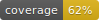

# Is the Gävle Goat Burning?



This project monitors the [Gävle Goat webcam](https://www.youtube.com/watch?v=P1VOrSoJXnc) feed to detect if the goat is on fire. It uses computer vision techniques to analyze the video feed and sends email and/or Discord notifications if fire is detected.

## Project Overview

The Gävle Goat is a giant straw goat built annually in Gävle, Sweden. It has become a tradition for vandals to attempt to burn it down. This project aims to provide real-time monitoring of the goat's status.

## Features

- **Real-time Fire Detection:** Utilizes computer vision to analyze the live webcam feed for signs of fire.
- **Advanced Fire Debouncing:** Prevents false positives from brief visual flickers by requiring a sustained detection before triggering alerts.
- **Email & Discord Notifications:** Sends immediate alerts to designated recipients via email and/or Discord webhooks.
- **Flexible Video Archiving:** Choose between two strategies for saving footage:
    - **Memory Mode (Default):** Keeps a pre-fire buffer in RAM for minimal disk I/O, flushing video to disk only when a fire is detected. This mode is optimized for performance and reduced wear on storage devices.
    - **Disk Mode:** Continuously saves video chunks to disk, ideal for systems with limited RAM.
- **Continuous Fire Recording:** Optionally record video for the entire duration of a fire event, plus a configured time after it is extinguished.
- **Dockerized Deployment:** Easily deployable with Docker, ensuring consistent performance across different environments.
- **CUDA Acceleration (Optional):** Supports CUDA for significantly faster processing on NVIDIA GPUs.

## Prerequisites

- Python 3.8 or higher
- NVIDIA GPU with CUDA drivers installed (if using CUDA acceleration)
- Docker (optional, for Docker deployment)

## INSTALLATION

1.  Clone the repository:
    ```bash
    git clone https://github.com/MilBia/IS-GOAT-BURNING.git
    cd IS-GOAT-BURNING
    ```

2.  Create and activate a virtual environment:
    ```bash
    python3 -m venv .venv
    source .venv/bin/activate
    ```

3.  Install dependencies:
    *   For a CPU-based installation:
        ```bash
        pip install .[cpu]
        ```
    *   For a GPU-based installation (requires a manual build of OpenCV with CUDA, see Docker instructions):
        ```bash
        pip install .
        ```

## Dependency Management

This project uses `pyproject.toml` as the single source of truth for all Python dependencies. The `requirements.txt`, `requirements-cpu.txt`, and `requirements-dev.txt` files are auto-generated from this file using `pip-tools`.

**Important: Do not edit the `requirements*.txt` files manually.**

If you need to add or change a dependency, edit `pyproject.toml` and then run the following commands from the root of the project to regenerate the files:

```bash
pip-compile --output-file=requirements.txt pyproject.toml
pip-compile --extra=cpu --output-file=requirements-cpu.txt pyproject.toml
pip-compile --extra=dev --extra=cpu --output-file=requirements-dev.txt pyproject.toml
```

## CONFIGURATION

1.  Create a `.env` file by copying the example:

    ```bash
    cp .env.example .env
    ```

2.  Edit the `.env` file and fill in your configuration details. Here's a breakdown of each setting:

| Variable | Description | Default |
| --- | --- | --- |
| `SOURCE` | URL of the webcam feed. | `"https://youtu.be/vDFPpkp9krY"` |
| `FIRE_DETECTION_THRESHOLD` | Percentage of frame pixels to trigger fire detection. | `0.1` |
| `LOGGING` | Logging level (`DEBUG`, `INFO`, `WARNING`, `ERROR`). | `"INFO"` |
| `VIDEO_OUTPUT` | Display the video feed window (for local debugging only). | `false` |
| `CHECKS_PER_SECOND` | How many times per second to analyze the video. | `1.0` |
| `OPEN_CL` | Enable OpenCL for acceleration (experimental). | `false` |
| `CUDA` | Enable CUDA for NVIDIA GPU acceleration. | `false` |
| `RECONNECT_DELAY_SECONDS` | Seconds to wait before reconnecting to a failed stream. | `5` |
| `STREAM_INACTIVITY_TIMEOUT` | Seconds to wait for a new frame before timing out. | `60` |
| | | |
| **Debouncing** | | |
| `FIRE_DETECTED_DEBOUNCE_SECONDS` | Seconds a fire must be continuously detected before an alert is triggered. `0.0` for immediate. | `0.0` |
| `FIRE_EXTINGUISHED_DEBOUNCE_SECONDS`| Seconds a fire must be continuously absent before the 'extinguished' state is registered. | `5.0` |
| | | |
| **Email Settings** | | |
| `EMAIL__USE_EMAILS` | Set to `true` to enable email notifications. | `false` |
| `EMAIL__SENDER` | Your sender email address. | `""` |
| `EMAIL__SENDER_PASSWORD` | Your email password or app password. | `""` |
| `EMAIL__RECIPIENTS` | Comma-separated list of recipient emails. | `""` |
| `EMAIL__EMAIL_HOST` | SMTP server host (e.g., `smtp.gmail.com`). | `""` |
| `EMAIL__EMAIL_PORT` | SMTP server port (e.g., `587`). | `""` |
| | | |
| **Discord Settings** | | |
| `DISCORD__USE_DISCORD` | Set to `true` to enable Discord notifications. | `false` |
| `DISCORD__HOOKS` | Comma-separated list of Discord webhook URLs. | `""` |
| | | |
| **Video Archiving** | | |
| `VIDEO__SAVE_VIDEO_CHUNKS` | Set to `true` to enable saving video to disk. | `false` |
| `VIDEO__VIDEO_OUTPUT_DIRECTORY` | Directory to save video files. | `"./recordings"` |
| `VIDEO__BUFFER_MODE` | Buffering strategy: `memory` (default) or `disk`. | `"memory"` |
| `VIDEO__MEMORY_BUFFER_SECONDS`| Duration (seconds) of pre-fire footage to keep in RAM in `memory` mode. | `60` |
| `VIDEO__VIDEO_CHUNK_LENGTH_SECONDS` | Length of each video chunk in seconds. | `300` |
| `VIDEO__MAX_VIDEO_CHUNKS` | Max number of `disk` mode chunks to keep (old ones are deleted). | `20` |
| `VIDEO__CHUNKS_TO_KEEP_AFTER_FIRE` | Defines the duration of post-fire recording (`chunks_to_keep * chunk_length`). | `10` |
| `VIDEO__RECORD_DURING_FIRE` | If `true`, recording continues for the entire fire duration plus the post-fire period. | `false` |
| `VIDEO__FLUSH_NUM_THREADS` | Number of threads for flushing memory buffer. Lower values reduce CPU contention. | `1` |
| `VIDEO__FLUSH_THROTTLE_FRAME_INTERVAL` | Number of frames to process before sleeping during flush. | `10` |
| `VIDEO__FLUSH_THROTTLE_SECONDS` | Duration (seconds) to sleep during flush throttle. | `0.01` |
| `VIDEO__FLUSH_THROTTLE_ENABLED` | If `true`, enables throttling during flush to reduce CPU/IO contention. | `false` |


**Important Notes**:

-   **Email Configuration:** For Gmail, you *must* generate an "App Password" in your Google account settings. Using your regular password is a security risk and may not work.
-   **Video Output:** `VIDEO_OUTPUT=true` is for local debugging only. Do not use it in a headless or Docker environment without X11 forwarding.
-   **CUDA:** `CUDA=true` requires a compatible NVIDIA GPU and properly installed drivers. See the Docker section for setup instructions.
-   **Video Buffer Mode (`VIDEO__BUFFER_MODE`):**
    -   `memory` (default): Holds a buffer of recent, compressed video frames in RAM. No data is written to disk during normal operation. When a fire is detected, this in-memory buffer is flushed to a file. This mode significantly reduces disk I/O but increases RAM usage. The amount of RAM needed is proportional to the buffer duration and video resolution/framerate.
    -   `disk`: Continuously saves video chunks to the disk. This has low RAM usage but causes constant disk I/O, which can be inefficient and cause wear on SSDs.

## HOW TO RUN

### Usage Python Directly:

1.  Ensure you have CUDA-enabled OpenCV installed if `CUDA` is set to `true`.

    - To verify CUDA-enabled OpenCV: after installing opencv run this command:
      ```bash
      python -c "import cv2; print(cv2.cuda.getCudaEnabledDeviceCount())"
      ```
      If it outputs a number greater than 0, CUDA is enabled.

2.  Run the project:

    ```bash
    python burning_goat_detection.py
    ```

### Use Docker:

Docker allows you to run the application in a consistent and isolated environment.  The following steps guide you through building and running the Docker image, with and without GPU support.

1.  **Install Docker:** If you haven't already, install Docker Desktop from [docker-desktop](https://www.docker.com/products/docker-desktop/). Follow the instructions for your operating system.

2.  **Install the NVIDIA Container Toolkit (REQUIRED for CUDA):**
    If you want to use CUDA acceleration within Docker, you *must* install the NVIDIA Container Toolkit on your host machine. This toolkit allows Docker containers to access your NVIDIA GPU.

    -   Follow the instructions for your operating system here: [NVIDIA Container Toolkit Installation Guide](https://docs.nvidia.com/datacenter/cloud-native/container-toolkit/latest/install-guide.html)
    -   **Important:**  After installing the NVIDIA Container Toolkit, you may need to restart your Docker daemon or your entire system for the changes to take effect.

3.  **Determine your GPU's Compute Capability (REQUIRED for CUDA):**
    -  CUDA applications are compiled for specific GPU architectures, identified by their "compute capability".  You need to determine your GPU's compute capability and set the `CUDA_ARCH_BIN` build argument accordingly.
    -  You can find your GPU's compute capability on NVIDIA's website.
    -  You will use this value in the `docker build` command.

4.  **Build the Docker image:**

    -  **Base run (CPU only):** This build will run the application using the CPU. This is suitable if you don't have an NVIDIA GPU or don't want to use CUDA.
        ```bash
        docker build --target cpu -t burning_goat_detection .
        ```

    -  **With GPU support (CUDA):** This build will run the application using the GPU.
        ```bash
        docker build --target gpu --build-arg CUDA_ARCH=YOUR_GPU_COMPUTE_CAPABILITY -t burning_goat_detection .
        ```
        -   **Replace `YOUR_GPU_COMPUTE_CAPABILITY` with the compute capability you determined in the previous step.** For example, if your GPU's compute capability is 8.6, the command would be:
            ```bash
            docker build --target gpu --build-arg CUDA_ARCH=8.6 -t burning_goat_detection .
            ```
        -   The `--build-arg CUDA_ARCH` flag passes the GPU architecture to the Dockerfile, which uses it to optimize the OpenCV build for your specific GPU.  If you skip this step, the application might not run correctly or might not use the GPU effectively.

    -  **With OpenCL support (Intel/AMD/RPi):** This build will run the application using OpenCL acceleration.
        ```bash
        docker build --target opencl -t burning_goat_detection .
        ```

5.  **Run the Docker container:**

    -  **Base run (CPU only):**
        ```bash
        docker run --name burning_goat_detection_container -d burning_goat_detection
        ```
        -   To save video chunks to your local machine, you need to mount a volume using the `-v` flag. By default, this maps to `/app/recordings` inside the container.
            -   **Example:**
                ```bash
                docker run --name burning_goat_detection_container -v /path/to/your/local/recordings:/app/recordings -d burning_goat_detection
                ```
            -   In this example, `/path/to/your/local/recordings` is a directory on your computer where you want to save the videos. The `/app/recordings` part is the default path inside the container. If you need to change this, please see the **Using a Custom Recordings Directory** section below.

    -  **With GPU support (CUDA):**
        ```bash
        docker run --gpus all --name burning_goat_detection_container -d burning_goat_detection
        ```
        -   `--gpus all`:  This flag is **critical** for enabling CUDA acceleration. It tells Docker to make all available GPUs accessible to the container. If you only want to use specific GPUs, you can specify their IDs instead (e.g., `--gpus device=0,1`).
        -   To save video chunks, mount a volume as shown above.
            -   **Example:**
                ```bash
                docker run --gpus all --name burning_goat_detection_container -v /path/to/your/local/recordings:/app/recordings -d burning_goat_detection
                ```
            -   In this example, `/path/to/your/local/recordings` is a directory on your computer where you want to save the videos. The `/app/recordings` part is the default path inside the container. If you need to change this, please see the **Using a Custom Recordings Directory** section below.

    -   **With OpenCL support (Intel/AMD/RPi):**
        You need to map the DRI devices to the container to allow access to the GPU.
        ```bash
        docker run --device /dev/dri:/dev/dri --name burning_goat_detection_container -d burning_goat_detection
        ```
        -   **Raspberry Pi Note:** Ensure you are using the KMS driver (dtoverlay=vc4-kms-v3d) in `/boot/config.txt`.

    -   **Configuring with an `.env` file:**
        The recommended way to provide configuration (like email credentials or Discord webhooks) is to use an `.env` file with the `--env-file` flag. This securely injects all your settings into the container.

        - **Example:**
          ```bash
          docker run --name burning_goat_detection_container \
            --env-file .env \
            -v /path/to/your/local/recordings:/app/recordings \
            -d burning_goat_detection
          ```

    -  **Using a Custom Recordings Directory:**
        If you wish to change the directory where videos are saved inside the container, you must update both the volume mount (`-v`) and provide the `VIDEO_OUTPUT_DIRECTORY` environment variable (`-e`). **The path for the environment variable must match the container-side path of the volume mount.**

        -   **Example with a custom directory:**
            ```bash
            docker run --name burning_goat_detection_container \
              -v /path/to/your/local/custom_vids:/app/custom_vids \
              -e VIDEO_OUTPUT_DIRECTORY=/app/custom_vids \
              -d burning_goat_detection
            ```

6.  **Accessing Container Logs:** To view the application's output and check for errors, you can view the container's logs:
    ```bash
    docker logs burning_goat_detection_container
    ```

7.  **Stopping and Starting the Container:**
    ```bash
    docker stop burning_goat_detection_container
    docker start burning_goat_detection_container
    ```

## Testing

This project uses `pytest` for unit and integration testing. A comprehensive test suite is located in the `tests/` directory.

### Running Tests Locally

It is recommended to run tests within a virtual environment.

1.  **Install Development Dependencies:**
    ```bash
    # Install main, dev, and cpu dependencies
    pip install -r requirements-dev.txt
    ```

2.  **Run the Test Suite:**
    The `PYTHONPATH=.` prefix is essential for ensuring that `pytest` can correctly locate the application modules.
    ```bash
    PYTHONPATH=. pytest
    ```

### Running Tests in Docker

This is the recommended way to validate changes in a clean, production-like environment.

#### CPU Tests

1.  **Build the CPU Test Image:**
    This command builds the `cpu-test` stage, which is based on the `cpu` image.
    ```bash
    docker build --target cpu-test -t goat-detector:test-cpu .
    ```

2.  **Run the CPU Test Suite:**
    The container will start, run `pytest`, and then remove itself.
    ```bash
    docker run --rm goat-detector:test-cpu
    ```

#### GPU Tests

1.  **Build the GPU Test Image:**
    This command builds the `gpu-test` stage, which is based on the `gpu` image and includes the necessary dependencies for running tests in a GPU-enabled environment.
    ```bash
    docker build --target gpu-test -t goat-detector:test-gpu .
    ```

2.  **Run the GPU Test Suite:**
    This command runs the GPU test image, enabling GPU access for the container. The CUDA-specific tests will now be executed.
    ```bash
    docker run --rm --gpus all goat-detector:test-gpu
    ```

#### OpenCL Tests

1.  **Build the OpenCL Test Image:**
    ```bash
    docker build --target opencl-test -t goat-detector:test-opencl .
    ```

2.  **Run the OpenCL Test Suite:**
    ```bash
    docker run --rm --device /dev/dri:/dev/dri goat-detector:test-opencl
    ```

## Troubleshooting Docker/CUDA Issues

*   **"CUDA driver version is insufficient for CUDA runtime version" Error:** This usually means that the CUDA drivers on your host machine are older than the CUDA version used in the Docker image. Update your NVIDIA drivers to the latest version.
*   **Application Runs on CPU Instead of GPU:**
    *   Ensure that you have correctly installed the NVIDIA Container Toolkit.
    *   Verify that you are passing the `--gpus all` flag to the `docker run` command.
    *   Check the application logs within the container for any CUDA-related errors.
*   **"Could not load cuDNN" Error:** This indicates that the cuDNN libraries are not correctly installed or configured in the Docker image.  Verify that the base image in your `Dockerfile_cuda` includes cuDNN (e.g., `nvidia/cuda:12.3.2-cudnn9-devel-ubuntu22.04`).

## SOURCES

-   [Gävle Goat](https://en.wikipedia.org/wiki/G%C3%A4vle_goat) - Information about the Gävle Goat.
-   [yt-dlp](https://pypi.org/project/yt-dlp/) - A youtube-dl fork with additional features.
-   [Fire Detection System](https://github.com/gunarakulangunaretnam/fire-detection-system-in-python-opencv) - The core computer vision logic for fire detection.
-   [Python Email Examples](https://docs.python.org/3/library/email.examples.html) - Example on email sending using python

## Contributing

Contributions are welcome! Please open an issue or submit a pull request.

## CODING STANDARD

We use `pre-commit` with `ruff` to ensure consistent code formatting and linting.

**Setup:**

1.  Install development dependencies:
    ```bash
    pip install -e .[dev,cpu]
    ```
2.  Activate hooks: `pre-commit install`
3.  Run checks: `pre-commit run --all-files`

**How to contribute**

-   Ensure you have set up your pre-commit hooks.

Let's keep the Gävle Goat on check! 🐐🔥
